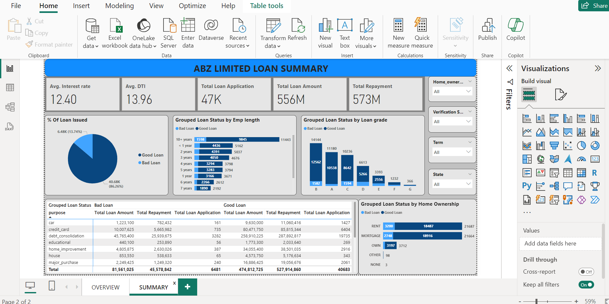

# Loan-Analysis
## Table of Contents

- [Project Overview](#project-overview)
- [Tools](tools)
- [Data Analysis](data-analysis)
- [Recommendations](recommendations)

### Project Overview
The data analysis aims to provide meaningful insights for ABZ Limited. By analyzing the loan dataset, we seek to identify key trends, patterns, factors related with loan defaults, offer useful suggestions for tactical decision-making and also exercise capabilities of Power BI.

### Tools
- Power Query - Data Cleaning.
- PowerBI - Creating report and Visualization.
 
### Data Cleaning/Preparation
Using Power Query, the “doesn’t meet the credit policy” rows under Loan status column were filtered off. This narrows down the dataset to focus on only customers/clients who got loans from ABZ Limited.
For adequate analysis, the following Key Performance Indicator (KPI) are required:
1.	Total Loan Applications: The total number of loan applications received. 
2.	Total Loan Amount: This is the sum total of disbursed loans to customers. 
3.	Total Amount Received: Total amount received as repayment from customers over time. 
4.	Average Interest Rate.
5.	Average Debt-to-Income Ratio (DTI): Calculating the average DTI for our customers helps us measure their financial health, assess their ability to manage debt and repay loan.

### Data Analysis

For flexible interaction and better visualization, I created a field parameter “Select Measure” for switching between total loan applications, total loan amount and total repayment.

The first objective is to give a detailed analysis of the dataset through visualizations and charts. The following were analyzed:
1.	Created a Card visual to show Average Interest Rate, Average DTI, Total Loan Application, Total Loan Amount and Total Repayment.

2.	Loan Purpose Breakdown: created a bar chart to analyze loan purposes by dragging the ‘purpose’ field into rows and including the field parameter.

3.	Loan Term Analysis: Developed a custom donut chart to visualize the distribution of loan terms.

4.	Home Ownership Analysis: Utilized a bar chart to analyze and visualize home ownership data.

5.	Loan amount per month: created a line chart to track trends over time by placing the issue months into columns to display monthly data in relation to the field parameter.

6.	Created a table visual to show customers state of residence against total applications, total loan amount and total repayment.
7.	Employment Length Analysis: developed a column chart to visualize employee tenure.

The second objective was to analyze the data and evaluate the lending activities in relation to the observed loan defaults. To do this we need to distinguish between Good and Bad loans based on certain criteria.
I created a group using the loan status column and categorized “Fully” and “Current” under Good Loan while others fell under Bad Loan. 
The following were analyzed: 
1.	Created a pie chart to show the percentage of customers under the Good and Bad Loan category.
2.	Grouped loan status by Employment length: generated a bar chart to analyze loan status in respect to length of employment.
3.	Loan Grade Analysis: Developed a column chart to compare the loan grade using the grouped loan status.
4.	Created a table visual to expatiate the grouped loan status under loan purposes, in reference to total applications, total loan amount and total repayment. 
5.	Home Ownership Analysis: Utilized a bar chart to analyze and visualize home ownership data in relation to loan status.

Insights:
1. Loan Application Trends: A total of 47k loan applications were received all through the captured period.
2. Funding Analysis: The total disbursed amount reached 556M.
3. Loan Repayment: Total amount repaid by customers stood at 573M.
4. Interest Rate and Debt-To-Income (DTI) Ratio: Interest rate varies based on employment length, loan amount and other factors. The average interest rate was 12.40%. Debt-To-Income ratio measures the percentage of a person’s monthly income that goes to debt payments. The average Debt-To-Income (DTI) ratio stood at 13.96%.
5. Good vs. Bad Loans: Good loans constituted a significant portion at 86.26%, with 40.68k applications, 474.8M loan amount and 527.9M loan repayment.
Bad loans accounted for 13.74%, comprising 6.48k applications, 81.6M loan amount and 45.6M loan repayment.
6. Overview Insights:
-	November and December experienced the highest loan application volumes totaling over 16k applications.
-	The primary purpose for loan application is debt consolidation. The number stands at 23k.
-	The state with the highest number of applications is California with a total of 8095.
-	Employees that have worked for over 10 years received the highest number of loans with 11.4k applications in total.
-	Rent and mortgage homeowners constituted the majority of loan recipients.
Summary Insights:
-	Using employment length, customers with over 10years employment tenure had the highest number of bad loans
-	Loan grade: Loan grade is a classification system used to assess credit risk. The letter grades assigned indicates the expected risks of the loan. Grade A have low risk, low interest rate etc while Grade G have high expected returns, high risk etc. In this analysis, Grade C customers constituted the highest number of bad loans while Grade B has the highest number of good loans.
-	Debt consolidation purpose emerged as the highest for bad loans.
-	Rent homeowners defaults the most.

### Visualization:
The report contains two pages, necessary filters were added to aid interaction with the visualizations.
You can interact with the report [here](https://app.powerbi.com/groups/me/reports/dc00a399-9d80-4107-8dfa-20e8da17b7b3/4e61290049a6cd61e62b?experience=power-bi) 

### Recommendations
Based on the analysis, I recommend the following:
1. Expand Loan Options: Given the strong demand for debt consolidation loans, it is best to broaden the loan portfolio to incorporate other in-demand types like home improvement loans.
2. Optimize for Seasonal Peaks: Analyze application trends from the peak months of November and December to design precision-targeted marketing campaigns and promotions that effectively boost applicant numbers during these high-traffic periods.
3. Loan Grade and Risk management: Apply more rigorous screening measures like redefining credit score models, collateral quality, asset verification and repayment facility to re-classify customers under loan grades. This will reduce the risk of problematic loans and identify customers with higher default risks. 
4. Loan terms: customers with short term loans (36months) are more likely to default a payment than the long term. To reduce this number, loan terms should be relaxed and 48months option can be introduced. The longer the term, the smaller the repayment but more interest may be paid over the life of the loan. 
5. Adjust Interest Rate: The average interest rate on bad loan is higher than that of good loan. To reduce the rate of defaulters significantly, consider adopting flexible rate adjustments. 

